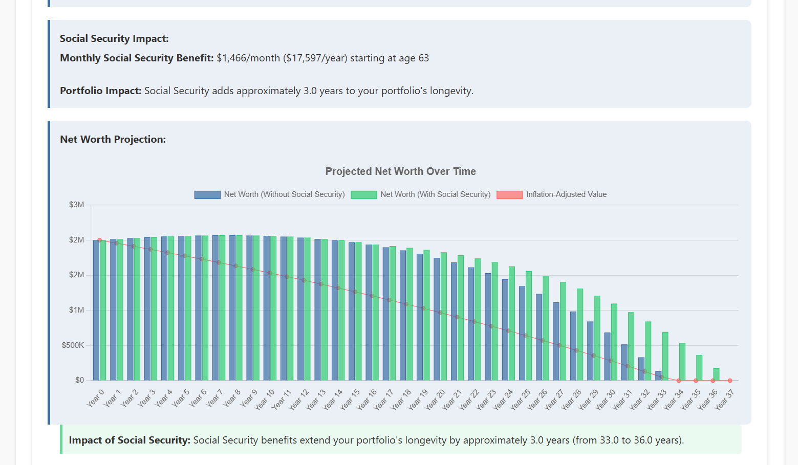

# Retirement Calculator Documentation

## Table of Contents
1. [Overview](#overview)
2. [Features](#features)
3. [How to Use the Calculator](#how-to-use-the-calculator)
4. [Core Calculations](#core-calculations)
5. [Social Security Benefits Analysis](#social-security-benefits-analysis)
6. [Tax Bracket Estimation](#tax-bracket-estimation)
7. [Data Visualization](#data-visualization)
8. [Technical Implementation Details](#technical-implementation-details)

## Overview

The Retirement Calculator is a comprehensive web application designed to help individuals assess their financial readiness for retirement. It combines multiple financial aspects of retirement planning including savings longevity analysis, Social Security optimization, and tax bracket estimation into a single interface.

This tool helps answer critical questions such as:
- Do I have enough saved for retirement?
- How long will my money last?
- When should I claim Social Security benefits?
- What will my tax situation look like in retirement?


## Features

### Core Retirement Analysis
- **Financial Readiness Assessment**: Determines if your current net worth is sufficient for retirement
- **Longevity Calculation**: Projects how long your savings will last based on withdrawal rates
- **Inflation Impact Analysis**: Shows how inflation will affect your purchasing power over time
- **Real Return Rate Calculation**: Factors in inflation to show true investment returns

### Social Security Optimization
- **Benefit Estimation**: Calculates benefits based on claiming age (62-70)
- **Strategy Comparison**: Visualizes how different claiming ages affect both benefit amount and portfolio longevity
- **Spouse Benefits Integration**: Includes spouse's benefits in the overall retirement plan
- **Coverage Analysis**: Shows what percentage of expenses Social Security will cover

### Tax Bracket Estimation
- **Retirement Tax Projection**: Estimates your tax bracket based on various retirement income sources
- **Income Source Analysis**: Displays how different income types contribute to your taxable income
- **Marginal vs. Effective Rate Comparison**: Shows the difference between your top tax bracket and overall tax rate
- **Tax Strategy Recommendations**: Suggests optimization strategies based on your specific tax situation

### Expense Analysis
- **Detailed Expense Tracking**: Breaks down expenses by category (housing, food, healthcare, etc.)
- **Total vs. Detailed View**: Choose between simple total monthly expenses or detailed categorization

### PDF Creation
- **Create PDF Report**: Creates a PDF Report of the key details and charts

## How to Use the Calculator

### Step 1: Enter Basic Information
- **Current Age**: Your current age
- **Current Net Worth**: Total value of your investments and savings intended for retirement

### Step 2: Enter Monthly Expenses
- Choose between entering **total monthly expenses** or **detailed expenses by category**
- If selecting detailed view, enter expenses for categories like housing, utilities, food, etc.

### Step 3: Set Financial Assumptions
- **Annual Withdrawal Rate**: Percentage of portfolio you'll withdraw annually (typically 3-5%)
- **Expected Annual Return**: Projected investment returns before inflation (typically 5-8%)
- **Expected Annual Inflation**: Projected inflation rate (typically 2-3%)

### Step 4: Social Security Benefits (Optional)
- Select whether to include Social Security benefits
- Enter your expected benefit at full retirement age (or use the estimator tool)
- Select your planned claiming age (62-70)
- Optionally include spouse's benefits

### Step 5: Tax Bracket Estimation (Optional)
- Select your filing status (Single, Married Filing Jointly, etc.)
- Choose between standard or itemized deductions
- Enter projected retirement income sources:
  - Social Security (auto-filled if entered earlier)
  - Pension income
  - Traditional IRA/401(k) withdrawals
  - Roth IRA/401(k) withdrawals
  - Investment income
  - Rental income
  - Other income

### Step 6: Calculate Results
- Click the "Calculate Retirement Readiness" button for core analysis
- Click the "Calculate Tax Bracket" button for tax analysis
- Review results in the various output sections

### Step 7: Create PDF Report (Optional)
- Click the red "Download PDF Report" button for a PDF report saved on your local computer

## Core Calculations

### Required Retirement Savings
```
Required Savings = Annual Expenses ÷ Withdrawal Rate
```
Example: $60,000 annual expenses ÷ 4% withdrawal rate = $1,500,000 required savings

### Real Return Rate
```
Real Return Rate = ((1 + Nominal Return Rate) ÷ (1 + Inflation Rate)) - 1
```
Example: ((1 + 7%) ÷ (1 + 2.5%)) - 1 = 4.39% real return rate

### Money Duration Calculation
The calculator uses a year-by-year simulation approach to determine how long your money will last:

1. Start with initial balance = net worth
2. For each year:
   - Calculate investment returns: balance × nominal return rate
   - Calculate withdrawal amount (adjusted for inflation each year)
   - New balance = previous balance + returns - withdrawal
   - Continue until balance reaches zero or exceeds maximum years (set at 200)

If the real return rate is greater than or equal to the withdrawal rate, money is considered to last indefinitely.

### Inflation Impact
The calculator shows purchasing power reduction using:
```
Future Purchasing Power = Current Amount ÷ (1 + Inflation Rate)^Years
```

## Social Security Benefits Analysis

### Benefit Adjustment by Claiming Age
The calculator adjusts the Full Retirement Age (FRA) benefit amount based on claiming age:
- **Before FRA (67)**: Reduces benefit by approximately 6.67% per year
- **After FRA**: Increases benefit by 8% per year

For example, claiming at 62 (5 years early) reduces benefits to about 70% of FRA amount, while claiming at 70 (3 years late) increases benefits to about 124% of FRA amount.

### Social Security Coverage Calculation
```
SS Coverage = (Annual SS Benefit ÷ Annual Expenses) × 100%
```

### Benefit Estimation Method
If you don't have a Social Security statement, the calculator estimates your benefit using:
1. Birth year (to determine Full Retirement Age)
2. Years worked (out of maximum 35)
3. Average annual income (highest 35 years)

The calculator then applies a simplified version of the Social Security benefit formula with bend points for Primary Insurance Amount (PIA) calculation.

## Tax Bracket Estimation

### 2025 Federal Tax Brackets
The calculator uses 2025 federal income tax brackets (projected with inflation adjustments):

#### Single Filers
- 10%: $0 to $11,925
- 12%: $11,926 to $48,500
- 22%: $48,501 to $103,400
- 24%: $103,401 to $197,450
- 32%: $197,451 to $250,800
- 35%: $250,801 to $626,950
- 37%: $626,951+

#### Married Filing Jointly
- 10%: $0 to $23,850
- 12%: $23,851 to $97,000
- 22%: $97,001 to $206,800
- 24%: $206,801 to $394,900
- 32%: $394,901 to $501,600
- 35%: $501,601 to $752,350
- 37%: $752,351+

### Standard Deductions (2025)
- Single: $15,000
- Married Filing Jointly: $30,000
- Head of Household: $22,550
- Married Filing Separately: $15,000

### Social Security Taxation
The calculator determines how much of your Social Security benefits are taxable using the IRS "combined income" formula:
```
Combined Income = AGI + Non-taxable interest + ½ of Social Security benefits
```

Taxable percentage based on combined income:

#### Single, Head of Household, Married Filing Separately
- Below $25,000: 0% taxable
- $25,000 to $34,000: 50% taxable
- Above $34,000: 85% taxable

#### Married Filing Jointly
- Below $32,000: 0% taxable
- $32,000 to $44,000: 50% taxable
- Above $44,000: 85% taxable

### Tax Calculation
1. Calculate taxable income after accounting for:
   - Social Security taxability
   - Tax-free income (Roth distributions)
   - Deductions (standard or itemized)
2. Apply progressive tax brackets to calculate federal tax
3. Calculate effective tax rate: Total Federal Tax ÷ Total Income

## Data Visualization

### Net Worth Projection Chart
- Shows projected net worth over time with and without Social Security
- Includes inflation-adjusted values
- Indicates portfolio depletion point

### Social Security Strategy Chart
- Compares monthly benefit amounts at different claiming ages (62-70)
- Shows impact on portfolio longevity for each claiming age

### Tax Analysis Charts
- **Income Sources Breakdown**: Doughnut chart showing composition of income
- **Tax by Bracket**: Pie chart showing amount of tax paid in each tax bracket

## Technical Implementation Details

### Key Technologies
- **HTML/CSS/JavaScript**: Core web technologies
- **Chart.js**: Data visualization library for all charts
- **No external dependencies**: Single HTML file with embedded JavaScript and CSS

### Calculation Methods
- **Portfolio Projection**: Year-by-year simulation approach
- **Social Security Adjustment**: Linear reduction/increase based on claiming age vs. FRA
- **Tax Calculation**: Progressive bracket system with separate handling for each income type

### Data Storage
- All data is session-based (not saved between browser sessions)
- No server-side processing or data storage
- All calculations performed client-side in the browser

### Accessibility Features
- Responsive design works on various screen sizes
- Clear color contrast for readability
- Semantic HTML structure

---

This retirement calculator provides a comprehensive framework for retirement planning, incorporating multiple financial aspects into a single tool. While it offers sophisticated analysis, remember that it's based on user inputs and projections which may not represent actual future conditions. For personalized financial advice, consider consulting with a certified financial planner.


[def]: screen.png