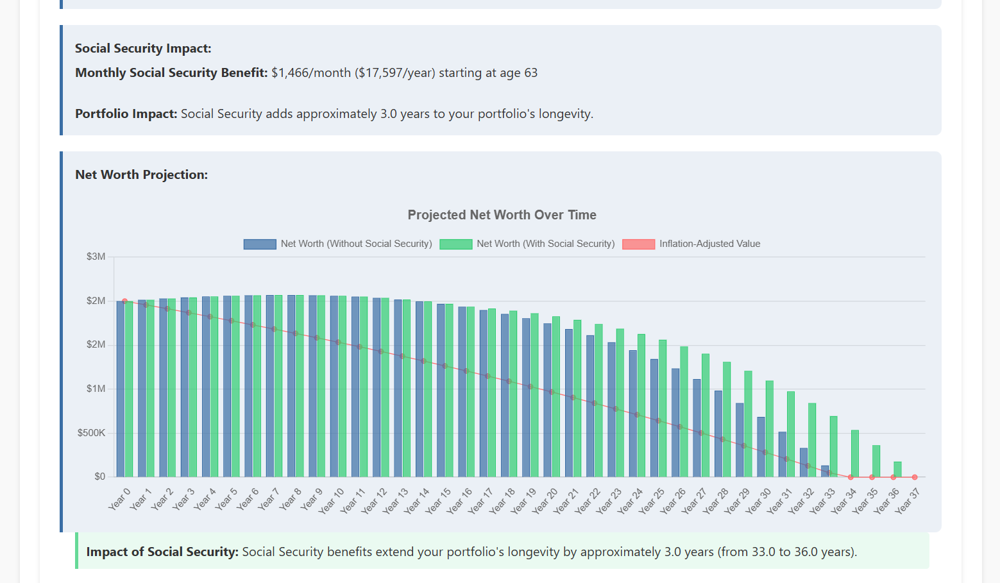

# Retirement Calculator

A static browser-based retirement planning calculator for quick what-if analysis around:

- retirement readiness
- portfolio longevity
- inflation impact
- Social Security timing
- basic federal retirement tax estimates
- printable PDF summaries



## What it does

This project helps answer practical planning questions like:

- How much do I need saved to support my spending?
- How long might my portfolio last under a given withdrawal rate?
- How much does Social Security reduce portfolio pressure?
- What does my retirement income mix do to my estimated federal taxes?

The app runs entirely client-side and can be opened as a simple static page.

## What it does **not** do

This calculator is useful, but it is still a simplified planning tool — not a full financial-planning engine.

It does **not** currently model all of the following:

- sequence-of-returns risk / Monte Carlo outcomes
- state income taxes
- required minimum distributions (RMDs)
- Medicare premiums / IRMAA
- ACA subsidy interactions
- detailed qualified-dividend / long-term capital gains handling
- changing spending by life stage
- long-term care shocks
- survivor / spousal Social Security edge cases in full detail
- future tax-law changes

Treat the results as **illustrative estimates**, not tax, legal, or investment advice.

## Project structure

The app is now organized as a small static site instead of a single giant HTML file:

- `index.html` — main app entry
- `retirement-calculator.html` — compatibility redirect to `index.html`
- `styles.css` — extracted styling
- `js/legacy-app.js` — existing browser/UI behavior from the original app
- `js/calculations.js` — extracted calculation helpers for easier testing
- `js/enhancements.js` — validation and UX improvements
- `tests/calculations.test.js` — automated tests for core formulas
- `docs/PLAN.md` — concrete improvement roadmap
- `docs/AUDIT.md` — technical and modeling audit notes

## Running locally

Because this is a static app, you can either open `index.html` directly or run a tiny local server.

### Option 1: open directly

Open `index.html` in your browser.

### Option 2: run a local server

```bash
python -m http.server 8000
```

Then open:

```text
http://localhost:8000
```

Or with `serve`:

```bash
npx serve .
```

## Testing

The repo now includes a lightweight Node-based test suite for the extracted calculation layer.

Run:

```bash
node --test tests/calculations.test.js
```

## Core modeling assumptions

### Retirement readiness

The required savings estimate uses:

```text
Required savings = annual expenses / withdrawal rate
```

This is useful as a planning heuristic, but it is not a guarantee of portfolio safety.

### Portfolio longevity

Portfolio longevity is estimated using a deterministic year-by-year simulation:

1. start with current portfolio balance
2. apply annual investment return
3. subtract annual spending
4. increase spending by inflation each year
5. continue until depletion or an upper cap is reached

This is intentionally simple and easy to reason about, but it does not model variable market returns.

### Real return rate

The app uses inflation-adjusted return math:

```text
Real return = ((1 + nominal return) / (1 + inflation)) - 1
```

### Social Security

Social Security claiming adjustments are currently simplified:

- early claiming reduces benefits using an approximate linear adjustment
- delayed claiming increases benefits using an approximate delayed-retirement-credit assumption
- the estimator is an approximation, not an SSA-grade benefits calculator

### Taxes

The tax section is best understood as a **basic federal estimate**.

Current limits include:

- no state tax handling
- simplified Social Security taxation thresholds
- investment income not fully separated into qualified dividends / LTCG vs ordinary income
- no RMD, IRMAA, or advanced retirement-tax planning logic

## Improvements included in this refactor

This round of work focused on maintainability and trust, not just adding more features.

### Codebase improvements

- split the app into HTML / CSS / JS files
- extracted core formulas into `js/calculations.js`
- added test coverage for several key formulas
- added `.gitignore`
- preserved backward compatibility with a redirect from `retirement-calculator.html`

### UX improvements

- added validation summary for invalid or inconsistent inputs
- added field-level validation styling
- added lightweight `localStorage` persistence so inputs survive refreshes
- added an in-app note clarifying that the calculator is illustrative

### Documentation improvements

- added `docs/PLAN.md`
- added `docs/AUDIT.md`
- rewrote this README to better explain scope, assumptions, and limitations

## Audit highlights

A quick summary of the highest-value recommendations:

1. replace `js/legacy-app.js` with a cleaner unified app controller
2. reduce duplicate event wiring and repeated calculation paths
3. improve Social Security and tax-model fidelity
4. add export/import for scenarios
5. consider optional scenario-based or Monte Carlo analysis later

See `docs/AUDIT.md` for the fuller write-up.

## Suggested next steps

If you want to keep improving the project after this refactor, the best order is:

1. simplify the UI/controller layer
2. improve tax accuracy around investment income
3. improve Social Security logic
4. add save/load/export/import scenarios
5. add richer scenario analysis

## Notes

This tool is already a good prototype for quick planning conversations. The main goal of this refactor is to make it easier to maintain, easier to review, and more honest about what the model does and does not cover.
